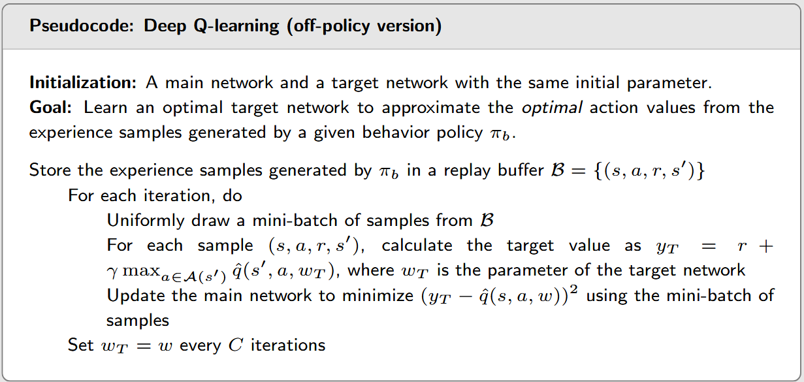

# Reinforcement Learning Theory

### Mathematics Foundations

1. Law of Total Conditional Expectation

    This law is utilized to derive the Bellman equation. The standard form of this equation is presented below:
    $$
    \mathbb{E}[X|Y=y] = \sum_z p(z|y)\mathbb{E}[X|Y=y, Z=z]
    $$
   

2. Contraction Mapping Theorem

   The contraction mapping theorem ensures that there is only one solution available for the Bellman Optimality Equation, and the solution must exist. Additionally, it provides an iterative algorithm to solve BOE. The theorem is defined as follow:

   

   

3. Robbins-Monro Theorem
   RM theorem ensures that RM algorithm can find the correct root of $g(w)=0$. It is a basic in stochastic approximation. The corresponding algorithm and theorem is described as follow:

   $$
   \begin{align}
   w_{k+1} &= w_k - a_k \tilde{g}(w_k,\eta_k)\\
   \tilde{g}(w_k, \eta_k) &= g(w_k) + \eta_k
   \end{align}
   $$

   where $w_k$ is the current estimate, $a_k$ is the step size, and $\eta_k$ is the noise term. The theorem ensures that the sequence $\{w_k\}$ converges to the root of $g(w)=0$.

   

### 1. Bellman Equation and Bellman optimality Equation

Firstly, we need to figure out the definition of state value and action value.

State value describe the goodness of a state. If a larger reward indicates a better state, then the state value is also the same. Below is the derivation of state value under policy $\pi$, where the mathematics include law of conditional expectation and Markov charactersation.

$$
\begin{align}
v_\pi(s) &= \mathbb{E}_\pi [G_t | S_t =s] \\
&= \mathbb{E}_\pi [\sum_{k=0}^{\infty}\gamma^k R_{t+k+1} | S_t =s] \\
&= \mathbb{E}_\pi [R_{t+1} + \gamma\sum_{k=0}^{\infty} \gamma^k R_{t+1+k+1} | S_t = s] \\
&= \mathbb{E}_\pi [R_{t+1} + \gamma G_{t+1} | S_t=s] \\
&= \mathbb{E}_\pi[R_{t+1}|S_t=s]+ \gamma \mathbb{E}_\pi[G_{t+1}|S_t=s] \\
&= \sum_\pi \pi(a|s)\mathbb{E}_\pi [R_{t+1} | S_t=s, A_t=a] + \gamma \sum_\pi \pi(a|s) \sum_{s'}p(s'|s,a) \mathbb{E}_\pi[G_{t+1}|S_t=s, A_t=a, S_{t+1}=s'] \\
&= \sum_\pi \pi(a|s)[\sum_r p(r|s,a)r + \gamma  \sum_{s'}p(s'|s,a) v_\pi (s')] \\
&= \sum_\pi \pi(a|s)q_\pi(s, a)
\end{align}
$$

By compiling all state values into a column vector and constructing the corresponding reward vector and probabilistic transformation matrix, we can derive the matrix-vector form of the Bellman equation. This form is equivalent to the element-wise form presented above:

$$
v_\pi = r_\pi + \gamma P_\pi v_\pi
$$

Regarding action value, it defines the value of an action under current state. The action value is decided by the immediate reward (the reward after executing the specific action) and the discounted future reward (the reward after executing the specific action and then following the policy).

$$
q_\pi (s, a) = \mathbb{E}_\pi [R_{t+1} + \gamma v_\pi(S_{t+1})|S_t=s,A_t= a]
$$

Bellman equation is used to describe the recurrent relationship of value / action-value function under any policy:

$$
v_\pi(s) = \mathbb{E}_\pi[R_{t+1} + \gamma v_\pi(S_{t+1})|S_t=s]\\
q_\pi (s, a) = \mathbb{E}_\pi [R_{t+1} + \gamma v_\pi(S_{t+1})|S_t=s,A_t= a]
$$

Bellman optimality equation describes the value /action-value under optimal policy:

$$
v^*(s) = max_\pi (r_\pi + \gamma P_\pi v_\pi(s)) \\
q^* (s, a)=\mathbb{E}_{\pi^*}[r_{t+1} + \gamma ~max_{a'}q^*(s', a') | s, a]
$$

Two approaches to solve the optimal policy. The correctness is guaranteed by contraction mapping theorem:

1. value iteration:

   policy update:

   $$
   \pi_{k+1} = arg~max_\pi(r_\pi + \gamma P_\pi v_k)
   $$

   value update:

   $$
   v_{k+1} = r_{\pi_{k+1}} + \gamma P_{\pi_{k+1}}v_k
   $$

2. policy iteration:

   policy evaluation:

   $$
   v_{\pi_k}= r_{\pi_k} + \gamma P_{\pi_k}v_{\pi_k}
   $$

   policy improvement:

   $$
   \pi_{k+1} = arg~max_\pi(r_\pi + \gamma P_\pi v_{\pi_k})
   $$

The distinctions between value iteration and policy iteration are readily apparent. In value iteration, the state value is updated using only a single iteration step. Conversely, policy iteration employs multiple iteration steps to update the state value. Within policy iteration, $v_{\pi_k}$ represents the precise state value, which necessitates solving the Bellman equation. 

To address this computational challenge, we introduce truncated policy iteration. This approach updates the state value using a fixed number of iterations, thereby circumventing the need for an infinite number of iterations or solving the Bellman equation via linear algebra methods such as computing the inverse matrix.

### 2. Solving state value / action value

#### Model based solution

1. closed-form solution

   Wirte the bellman equation in matrix form and solve it using linear algebra methods.

   $$
   v_\pi= (1-\gamma P_\pi)^{-1}r_\pi
   $$

2. iterative algorithm

   The correctness of the iterative algorithm is guaranteed by the contraction mapping theorem. This theorem states that if a sequence of functions converges to a fixed point, then the sequence of function values converges to the fixed point. In the context of Bellman equations, the contraction mapping theorem ensures that the sequence of state values converges to the exact state values.

   $$
   v_{k+1} = max_\pi(r_\pi+ \gamma P_\pi v_k)
   $$
   

#### Model free solutions (state value)

1. Monte Carlo Exploring starts

   Without model describing enviroment, such as $p(r\|s, a)$ indicating the reward of taking action $a$ in state $s$, we can estimate the state value using Monte Carlo method. Specifically, we need to interact with enviroment, generate reward and next state according to current state, action to be taken and the implicit characteristic of enviroment. After gaining a trajectory like $s_0, a_0, r_1, s_1, a_1, ...$, we can infer the enviroment by the expectation of it.

   

   The above algorithm has a problem that the policy is a greedy policy, so it is possible that not all possible $(s,a)$ pairs are produced in the interaction process with the environment. Therefore, we can adopt a soft policy, which means adding some exploration:

   

   

2. TD-learning

   RM algorithm provides a general method to solve the root of $g(w)=0$, which is a general form of most stochastic approximation methods. Why RM algorithm matters? Because in most case we want to find the maximum or extreme value of a function, which is equivalent to find the root of its derivative.

   TD-learning is a special form of RM algorithm, where it replaces one quantity with another. (See L7. 17-19)

   First of all, our goal is to solve the root of the following equation:

   $$
   g(v(s)) = v(s) - \mathbb{E}[R+\gamma v_\pi(S')|s] = 0
   $$

   The former $v(s)$ is the one we want to estimate, and the latter expectation is the actual stae value. Based on RM algorighm, we need to construct $\tilde{g}(v(s), \eta_k)$:

   $$
   \begin{align}
   \tilde{g}(v(s), \eta_k) &= v(s) - [r+\gamma v_\pi(s')] \\
   &= (v(s) - \mathbb{E}[R+\gamma v_\pi (S') | s]) + (\mathbb{E}[R+\gamma v_\pi (S') | s] - [r+\gamma v_\pi (s')])
   \end{align}
   $$

   Then the RM algorithm solves the equation $g(v(s)) = 0$ as follows:

   $$
   v_{k+1}(s) = v_k(s) - \alpha_k \tilde{g}(v_k(s)) = v_k(s) - \alpha_k ( v(s) - [r+\gamma v_\pi(s')])
   $$

   In standard RM algorithm, we need to solve a state value $v_\pi(s')$, which appears in the right side of the equation. So we need to change this quantity to an obtainable quantity, which is $v_t(s_{t+1})$, where we use current state value mapping (i.e. v(s)) to estimate the state value of next state. This is an on-policy method.

   $$
   v_{t+1}(s_t) = v_t(s_t) - \alpha_t(s_t) [v_t(s_t) - [r_{t+1} + \gamma v_t(s_{t+1})]]
   $$
   

#### Model free solutions (action value)

1. Sarsa (state - action - reward - state - action)

   Actually Sarsa is very similar to TD-learning, but it estimates the action value rather than state value. The iterative derivation formula is shown as follows:

   $$
   q_{t+1}(s_t, a_t) = q_t(s_t, a_t) - \alpha_t(s_t, a_t)[q_t(s_t, a_t)- [r_{t+1} + \gamma q_t(s_{t+1}, a_{t+1})]]
   $$

   

   n-step Sarsa is a trade-off between Sarsa and Monte Carlo. Call back to Sarsa, we use $r_{t+1}+\gamma q_t(s_{t+1}, a_{t+1})$ to replace the true action value, and MC learning uses the average of many samples to approximate the true action value. n-step Sarsa is a compromise between the two methods. It samples n steps of the episode and then calculates the discount reward. The formula is shown as follows:
   
   $$
   q_{t+1}(s_t, a_t) = q_t{s_t, a_t} - \alpha_t(s_t, a_t)[q_t(s_t, a_t) - (r_{t+1} + \gamma r_{t+2} + ... + \gamma^n q_t(s_{t+n}, a_{t+n}))]
   $$

   In $t$ moment, we still need to wait for $n$ steps to interact with the environment to gain enough samples for estimating true $q_t(s_{t+1}, a_{t+1})$.

   

2. Q-learning

   Q-learning solves the Bellman optimal equation directly, which differs from Sarsa and Q-learning solving the Bellman equation.

   $$
   q_{t+1}(s_t, a_t) = q_t(s_t, a_t) - \alpha_t(s_t, a_t)[q_t(s_t, a_t) - (r_{t+1} + \gamma max_{a \in \mathcal{A}}~ q_t(s_{t+1}, a))] \\
   q_{t+1}(s, a) = q_t(s, a), \forall(s, a) \neq (s_t, a_t)
   $$
   

To summary the above, all methods with temperal difference characteristic can be represented as follows:

$$
q_{t+1}(s_t, a_t) = q_t(s_t, a_t)-\alpha_t(s_t, a_t)[q_t(s_t, a_t) - \overline{q_t}]
$$

And the corresponding $\overline{q_t}$s are shown below:

Each TD algorithm solves the following equation, either the Bellman equation or the Bellman optimal equation.

### Function approximation

In the above section, the state value or action value is store in a table. For example, using two dimensions to represent the action value, we need to store $$\|S\|$$ rows and $$\|A\|$$ columns, and the element is the action value under specified state and action. However, when the state space is large, the table will consume huge memory space, which is unpractical. To solve the problem, we use function approximation. Specifically, we can use high-order function or neural network to fit the actual value, under which a huge table with massive discrete value is replaced by some few parameters.

For example, to reprensent state value, minimizing the difference between $v_\pi(s)$ and $\hat{v}(s, w)$ is our goal, where $w$ is the parameter. To achieve this goal, we need to: 1. define the objective function; 2. write the algorithm to optimize the objective function.

The objective function is as follows:

$$
J(w) = \mathbb{E}[(v_\pi (S) - \hat{v}(S, w))^2]
$$

, where $S$ is random variable. To find the expectaion, we need to know the distribution of $S$, then we can expand the expectation to an soluable element-wise form (recall the definition of expectation). A simple assumption is that $S$ obeys uniformly distributed, then:

$$
J(w) = \mathbb{E}[(v_\pi (S) - \hat{v}(S, w))^2] = \frac{1}{|\mathcal{S}|} \sum_{s\in \mathcal{S}}(v_\pi (s) - \hat{v}(s, w))^2
$$

But somewhat we want to give different weights to different states, for example, some states occur more frequently, then they should have larger weights.

Therefore, we use a stable distribution (stationary distribution), which describes the long-run behavior. We can estimate $d$ using the frequency of states, fact that $d_\pi(s)$ is the eigenvalue of state transition matrix $P_\pi$, but we cannot get $P_{i,j}$ (the probability of state $i$ to state $j$).

$$
J(w) = \mathbb{E}[(v_\pi (S) - \hat{v}(S, w))^2] = \sum_{s\in \mathcal{S}}d_\pi(s)(v_\pi (s) - \hat{v}(s, w))^2 \\
d_\pi(s) = \frac{n_\pi(s)}{\sum_{s'\in \mathcal{S}}n_\pi(s')}
$$

Applying stochastic gradient descent to the objective function, we can minimizing $J(w)$. The gradient of $J(w)$ to $w$ is as follows:

$$
\nabla J(w) = -2\mathbb {E}[(v_\pi(S) - \hat{v}(S, w)) \nabla_w \hat{v}(S,w)]
$$

, where $\alpha_k$ is the learning rate.

However, since the true gradient needs to calculate the expectation, and we need to calculate $\nabla_w \hat{v}(S,w)$, if it is a neural network function expression, we do not know how to calculate the gradient. Therefore, the formula derived from the derivation is not applicable in actual training. We can replace the expectation with sampling value; similarly, the true gradient needs a state value, which we can predict using the idea of MC or normal TD-learning. The conversion process is as follows:

$$
w_{k+1} = w_k + \alpha_k \mathbb{E}[(v_\pi(S) -\hat{v}(S, w)) \nabla_w \hat{v}(S, w)] \\
w_{t+1} = w_t + \alpha_t(v_\pi(s_t) - \hat{v}(s_t, w_t))\nabla_w \hat(v)(s_t, w_t)\\
v_\pi(s_t) = \sum_{k=0}^{T}\gamma ^k r_{t+k+1} ~~ (MC) \\
v_\pi(s_t) = r_{t+1} + \gamma\hat{v}(s_{t+1}, w_t) ~~ (spirit \; of \; TD)
$$

Below we provide the pseudo code of Sarsa with function approximation. Notice that we directly update $q_{t+1}(s_t, a_t)$ before, but now we can't store this value in a table. Therefore we update the parameter $w_{t+1}$. Naturally we do the same thing: estimate Q-value, solve the optimal policy (here we use $\epsilon$-greedy policy to balance exploration and exploitation).

> We mention stationary distribution before, and actually it implies in the update algorithm. For example, in the pseudo code of Sarsa with function approximation, we sample a trajectory $(s_t, a_t, r_{t+1}, s_{t+1})$ from the environment, and then use it to update the parameter $w_{t+1}$. If the state ocurrs many times, it will have a high probability to be sampled, leading a significant influance to the parameter $w$.

Q-learning is the same as Sarsa, but it directly solves the Bellman optimal equation. The pseudo code is as follows:

### Deep Q Network (DQN)

Recall the Q-learning with function approximation, the algorithm runs on an episode sampled from the environment. It has the following disadvantages:

1. High correlation between samples (continous state sequence)
2. Train process is not stable. Because matrix used to estimating the action value of the next state ($max_{a\in \mathcal{A}} \hat{q}(s_{t+1}, a, w_t)$) is the same as the one used to estimate the action value of the current state ($\hat{q}(s_t, a_t, w_t)$). Updating the parameter will change two quantities in the parameter update equation, leading to unstable.

DQN mainly use two techniques to solve the above two problems:

1. Experience Replay

   - Put the interaction data $(s,a,r,s')$ into a **replay buffer**. Sample a mini-batch from the replay buffer to train the model.

   - Benefits: break the correlation between samples; reuse past data, improve sample efficiency

2. Target Network

   - Maintain another network $w_T$ to predict $max_{a\in \mathcal{A}} \hat{q}(s_{t+1}, a, w_T)$, and periodically update $w_T$ to $w$.

   - Benefits: reduce the correlation between samples, improve stability.

### Policy Gradient

In the previous section we use function approximation to store massive state value or action value. In this section we discuss about policy $\pi(a|s)$. The policy is in tabular representation previously, and it's not memory-efficient when the action space is large. So we discard the traditional Bellman equation and turn to policy gradient. It directly optimize the policy $\pi(a|s)$ with gradient descent, and policy is represented as a set of parameters, i.e., $\pi(a, \theta)$, where $\theta$ is the parameter of a function or a neural network.

The way of thinking is the same as replacing tabular representation by function approximation. We first define a metric and then calculate its gradient for maximizing the metric (gradient ascent) or minizing the metric (gradient descent). Defining a proper metric is somehow difficult. Recalling before we choose the optimal policy by making the probability of the optimal action (action with the maximum action value) equal to 1, in which we can maximize the state value. Now our goal is also maximizing the state value or action value. For instance, maximizing the state value:

- first metric:

  1. $\overline{v}_\pi = \mathbb{E}_{S \sim d}[v_\pi (S)]$. $S\sim d$ represents the random variable $S$ is sampled from the distribution $d$, i.e., $\sum_{s \in S} d(s) = 1$.

     We hope $d(S)$ is a stationary distribution. In other words, the probability of the state $S$ is not changed after a step of transition. Considering a Markov chain, the probability of each state transition is fixed. There exists a unique probability distribution $d(s') = \sum_s d(s) P(s' | s)$. That is to say, after one step of transition, the probability distribution of state does not change, the distribution of $s'$ keep the same. 

  2. $\overline{v}_\pi^0 = \mathbb{E}_{S \sim d_0}[v_\pi (S)]$. It is a special case, where $d_0$ and $\pi$ are independent. In such case we treat all states equally every step. 

- second metric
  
  1.  $\overline{r}_\pi = \sum_{s\in S}d_\pi(s)r_\pi(s), ~r_\pi(s) = \sum_{a\in \mathcal{A}}\pi(a|s)r(s, a), ~ r(s, a) = \sum_r rp(r|s, a)$. This is to maximize the expected reward of each state.
  2.  Actually, $\overline{r}_\pi = (1-\gamma)\overline{v}_\pi$ holds.

For $J(\theta) = lim _{n \rarr \infty}\mathbb{E}[\sum_{t=0}^n \gamma^t R_{t+1}] = \mathbb{E}[\sum_{t=0}^\infty \gamma^t R_{t+1}] = \overline{v}_\pi$ or $J(\theta) = lim _{n \rarr \infty}\frac{1}{n} \mathbb{E}[\sum_{t=0}^{n-1} R_{t+1}] =lim _{n \rarr \infty}\frac{1}{n} \mathbb{E}[\sum_{t=0}^{n-1} R_{t+1}] = \overline{r}_\pi$, their directive have the same form (the proof is relatively complex, so I decide to halt here, just remember the conclusion):

$$
\nabla _\theta J(\theta) = \sum_{s\in \mathcal{S}} \eta(s) \sum_{a\in \mathcal{A}} \nabla _\theta \pi(a|s, \theta)q_\pi(s,a)
$$

Actually, the form of the gradient above is not suitable for training neural network with stochastic gradient descent. Because the stationary distribution $\eta(s)$ of state $s$ is unknown, we hope there is a formula of expectation. Thus, we have the following equivalent form:

$$
\nabla_\theta J(\theta) = \mathbb{E}_{S\sim \eta, A\sim \pi}[\nabla _\theta ln\pi(A|S, \theta)q_\pi(S, A)] \approx \nabla _\theta ln\pi(a|s, \theta)q_\pi(s, a)
$$

Proof of the equivalence of the two forms is not difficult, details can be found in L9. P29-P30. With the above form, we can approximate the gradient with sampled data. Below is the pseudo code of Monte Carlo policy gradient:

### Actor-Critic

This architecture is actually a combination of gradient policy and value estimation. Because in the parameter update of gradient policy, we need to predict the action value, which can be obtained by Temporal Difference. So this actor-critic is divided into two steps:

1. Actor is used to update the policy parameter:
   
   $$
   \theta_{t+1} = \theta_{t} + \alpha_\theta \nabla _\theta ln \pi(a_t|s_t, \theta_t)q(s_t, a_t, w_t)
   $$

   Here we use stochastic gradient ascent, which is equivalent to Sarsa+value function approximation.

2. Critic is used to update the value parameter:
   
   $$
   w_{t+1} = w_t + \alpha_w [r_{t+1} + \gamma q(s_{t+1}, a_{t+1}, w_t) - q(s_t, a_t, w_t)]\nabla_w q(s_t, a_t, w_t)
   $$

   Here we use stochastic gradient descent, which is equivalent to Q-learning.

This algorithm is called QAC (Q Actor-Critic), and below is the simplest form. We can improve this form in many ways.

#### Improvement 1: Add a Baseline Invariance

In the original gradient formula, adding a bias term does not affect the formula:

$$
\begin{align}
\nabla_\theta J(\theta) &= \mathbb{E}_{S\sim \eta, A\sim \pi}[\nabla_\theta ln \pi(A|S,\theta_t)q_\pi(S,A)] \\
&=  \mathbb{E}_{S\sim \eta, A\sim \pi}[\nabla_\theta ln \pi(A|S,\theta_t)(q_\pi(S,A) - b(S))]
\end{align}
$$

This can be easily proof by proofing $\mathbb{E}_{S\sim \eta, A\sim \pi}[\nabla_\theta ln \pi(A|S,\theta_t)b(S)] = 0$. This means that the gradient of policy with respect to parameter $\theta$ is invariant to the baseline $b(S)$.

In the update of gradient, adding this term can make the gradient update more stable. Although $b(S)$ does not affect $\mathbb{E}[X]$, but it does affect $var(X)$. Because

$$
tr[var(X)] = \mathbb{E}[X^T X] - \overline{x}^T \overline{x} \\
\begin{align}
\mathbb{E}[X^TX] &= \mathbb{E}[(\nabla_\theta ln\pi)^T(\nabla_\theta ln\pi)(q_\pi(S,A) - b(S))^2] \\
&=\mathbb{E}[||\nabla_\theta ln\pi||^2(q_\pi(S,A) - b(S))^2]
\end{align}
$$

So we need to choose a suitable $b(S)$ to minimize $var(X)$.

The optimal form of $b(S)$ is quite complex, so we choose a suboptimal form. The suboptimal form of $b(S)$ is actually the state value:

$$
b^*(s) = \frac{\mathbb{E}_{A \sim \pi}[||\nabla_\theta ln\pi(A|s,\theta_t)||^2q_\pi(s, A)]}{\mathbb{E}_{A \sim \pi}[||\nabla_\theta ln\pi(A|s,\theta_t)||^2||]} \\
b(s) = \mathbb{E}_{A \sim \pi}[q_\pi(s, A)] = v_\pi(s)
$$

With the above formula, we can replace the expectation with a sample. Thus, we can use stochastic gradient descent to update the policy parameter. And $q_t(s_t, a_t)$ can be represented by $v_t(s_{t+1})$, so we only need one network to predict the state value.

$$
\begin{align}
\theta_{t+1} &=  \theta_t + \alpha \nabla _\theta~ ln \pi(a_t|s_t, \theta_t)\delta_t(s_t, a_t) \\
\delta_{t}(s_t, a_t) &= q_t(s_t, a_t) - v_t(s_t) \rarr r_{t+1} + \gamma v_t(s_{t+1}) - v_t(s_t) \\
\end{align}
$$

In the update of critic, we can use the same method as Q-learning.

$$
w_{t+1} = w_t + \alpha_w [r_{t+1} + \gamma v_t(s_{t+1}) - v_t(s_t)]\nabla_w v_t(s_t)
$$

Here stochastic gradient descent has a interesting interpretation, which can explain why this policy parameter update is good at balancing exploration and exploitation:

$$
\begin{align}
\theta_{t+1} &=  \theta_t + \alpha \nabla _\theta~ ln \pi(a_t|s_t, \theta_t)\delta_t(s_t, a_t) \\
&= \theta_t + \alpha \frac{\nabla_\theta \pi(a_t|s_t, \theta_t)}{\pi(a_t|s_t, \theta_t)}\delta_t(s_t, a_t) \\ 
&= \theta_t + \alpha \big (\frac{\delta_t(s_t, a_t)}{\pi(a_t|s_t, \theta_t)}\big )\nabla_\theta \pi(a_t|s_t, \theta_t)
\end{align}
$$

When $q_t(s_t, a_t)$ and $v_t(s_t)$ are very different, $\delta_t(s_t, a_t)$ is very large, and the update amplitude is also very large, which is exploration. And when $\pi(a_t|s_t, \theta_t)$ is very small, which means the probability of selecting this action is very small, the update amplitude is also very large (it is the denominator), which is exploitation.

Below is the pseudo code of A2C with baseline variance. It is on-policy algorithm, because the parameters updated each batch are also used to predict state value. And the network is trained in an episode, which may incur issues such as high sample correlation and unstable gradient updates:

#### Improvement 2: Off-Policy+Importance Sampling

In off-policy, the policy used to predict $\mathbb{E}_{A\sim \pi}[*]$ is different from the policy used to sample and generate episodes. Their distributions may vary. For example, $\pi_0(a_0|s) = 0.5, \pi_0(a_1|s) = 0.5$, while $\pi_1(a_0|s) = 0.8, \pi_1(a_1|s) = 0.2$. If we want to use the episodes generated by the $\pi_1$ policy to predict $\mathbb{E}_{a\in \pi_0}[*]$ (where $\pi_0$ is the target policy and $\pi_1$ is the behavior policy), we need to use importance sampling. This is because the average of samples generated under the $\pi_1$ policy is **biased** compared to the expectation of the distribution under the $\pi_0$ policy.

Importance sampling can be applied to any off-policy algorithm mentioned above. Its core idea is relatively simple:

$$
\mathbb{E}_{X\sim p_0}[X] = \sum_x p_0(x)x = \sum_x \frac{p_0(x)}{p_1(x)}x p_1(x) = \mathbb{E}_{X\sim p_1}[\frac{p_0(X)}{p_1(X)}X]
$$

where $p_0$ is the target distribution and $p_1$ is the behavior distribution.

Therefore, to estimate $\mathbb{E}_{X\sim p_0}[X]$, we only need to sample $n$ times under the distribution $p_1$ and calculate the average of the samples:

$$
\mathbb{E}_{X\sim p_0}[X] \approx \overline{f} = \frac{1}{n}\sum_{i=1}^n \frac{p_0(x)}{p_1(x)} x_i
$$

where $f(x) = \frac{p_0(x)}{p_1(x)} x$.

Back to policy gradient, we only need to make some simple modifications to the gradient calculation. Assume that the behavior policy is $\beta$ and the target policy is $\pi$, then:

$$
\begin{align}
\nabla_\theta J(\theta) &= \mathbb{E}_{S\sim p, A\sim \pi}[\nabla_\theta~ln\pi(A|S,\theta)q_\pi(S,A)] \\
&=\mathbb{E}_{S\sim p, A\sim \beta}[\frac{\pi(A|S, \theta)}{\beta(A|S, \theta')}\nabla_\theta~ln\pi(A|S,\theta)q_\pi(S,A)]
\end{align}
$$

Combined the first improvement, i.e., baseline variance, we get the final form of policy gradient:

$$
\begin{align}

\theta_{t+1} &= \theta_t + \alpha_\theta \frac{\pi(a_t|s_t, \theta_t)}{\beta(a_t|s_t, \theta')}\nabla_\theta ~ln\pi(a_t|s_t, \theta_t)(q_t(s_t, a_t) - v_t(s_t)) \\
&\approx \theta_t + \alpha_\theta \frac{\pi(a_t|s_t, \theta_t)}{\beta(a_t|s_t, \theta')}\nabla_\theta ~ln\pi(a_t|s_t, \theta_t)(r_{t+1}+\gamma v_t(s_{t+1}) - v_t(s_t)) \\
&\approx \theta_t + \alpha_\theta \big (\frac{\delta_t(s_t, a_t)}{\beta(a_t|s_t, \theta')}\big) \nabla_\theta ~\pi(a_t|s_t, \theta_t)
\end{align}
$$

Pseudo code of the algorithm:

### Deterministic Policy Gradient (DPG)

In the previous section we use stochastic policy, which means each action has a probability greater than 0. If we use deterministic policy, which means the probability of each action is 0 except for one action, it is called deterministic policy. In the action space is infinite, we may not be able to define infinite dimensions to represent infinite actions. Each action is mapped to an action, i.e., $\mu(s,\theta) =a$ directly gives the action, rather than the probability of each action.

Assume we choose the average state value as the metric:

$$
J(\theta) = \mathbb{E}[v_\mu(s)]
$$

Its gradient is as follows. Concrete derivation please refer to the original book. Here we omit the derivation process because it is quite complex. The gradient does not include the distribution of actions because we do not assume the distribution of actions.

$$
\begin{align}
\nabla_\theta J(\theta) &= \sum_{s\in\mathcal{S}}\rho_\mu(s)\nabla_\theta \mu(s)(\nabla_a q_\mu(s,a)) |_{a=\mu(s)} \\
&= \mathbb{E}_{S\sim \rho_\mu}[\nabla_\theta \mu(S)(\nabla_a q_\mu(S,a)) |_{a=\mu(S)}]

\end{align}
$$

Based on the above gradient, the corresponding stochastic gradient ascent algorithm (maximize $J(\theta)$) is as follows:

$$
\theta_{t+1} = \theta_t + \alpha_\theta \nabla_\theta \mu(s_t)(\nabla_a q_\mu(s_t, a))|_{a=\mu(s_t)}
$$

The pseudo code of the algorithm is as follows:

